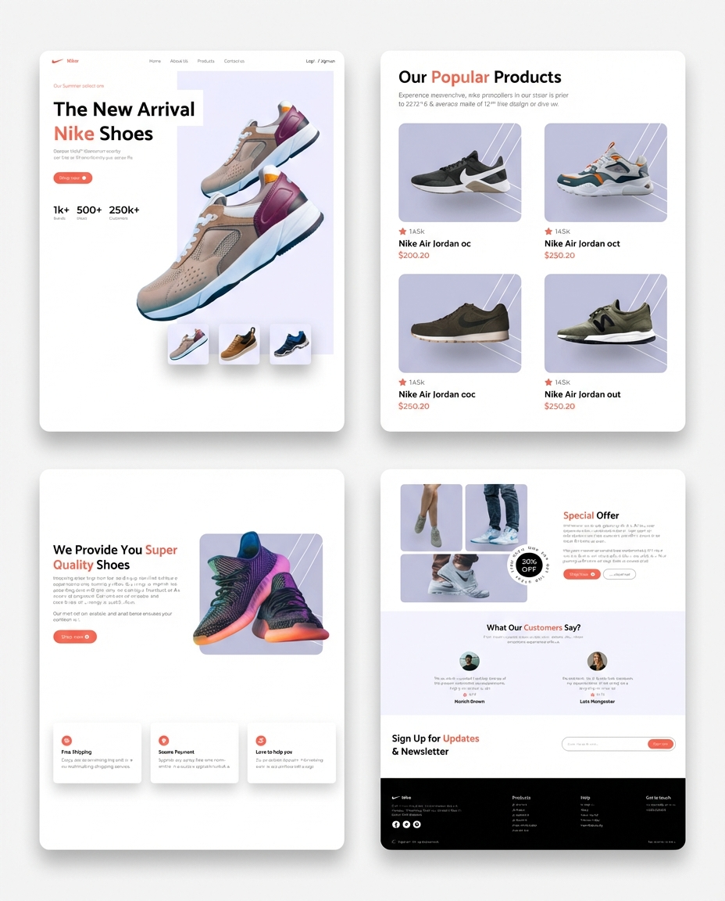

# 👟 Nike Landing Page Clone

### 🌐 [View Live Demo](https://mellifluous-faun-cc7a05.netlify.app/)

A stunning, fully responsive landing page for a shoe brand (Nike concept), built with **React** and **Tailwind CSS**. This project demonstrates modern UI/UX principles, component-based architecture, and responsive design.

## 🌟 Features

- **Responsive Design:** Looks great on all devices (Mobile, Tablet, Desktop).
- **Modern UI:** Clean and aesthetic interface using Tailwind CSS.
- **Component Based:** Modular architecture using React components.
- **Dynamic Elements:** Interactive shoe cards and hover effects.

## 🛠️ Tech Stack

- **React.js**
- **Tailwind CSS**
- **Vite** (Build Tool)

## 📸 Screenshots



## 📂 Project Structure

- `Nav`: Navigation bar.
- `Hero`: Main landing section with shoe showcase.
- `PopularProducts`: Grid display of top-rated shoes.
- `SuperQuality`: Feature section highlighting quality.
- `Services`: Information about shipping and support.
- `SpecialOffer`: Promotional section.
- `CustomerReviews`: Testimonials section.
- `Subscribe`: Newsletter signup.
- `Footer`: Site footer with links.

## 🚀 Getting Started

Follow these steps to run the project locally:

1. **Clone the repository:**

```bash
   git clone https://github.com/rzakhosravi1/Nike-Landing-Page.git

Install dependencies:
bash
   npm install

Start the development server:
bash
   npm run dev

🤝 Contributing
Contributions are what make the open source community such an amazing place to learn, inspire, and create. Any contributions you make are greatly appreciated.

Fork the Project
Create your Feature Branch (git checkout -b feature/AmazingFeature)
Commit your Changes (git commit -m 'Add some AmazingFeature')
Push to the Branch (git push origin feature/AmazingFeature)
Open a Pull Request
📄 License
Distributed under the MIT License.
```
